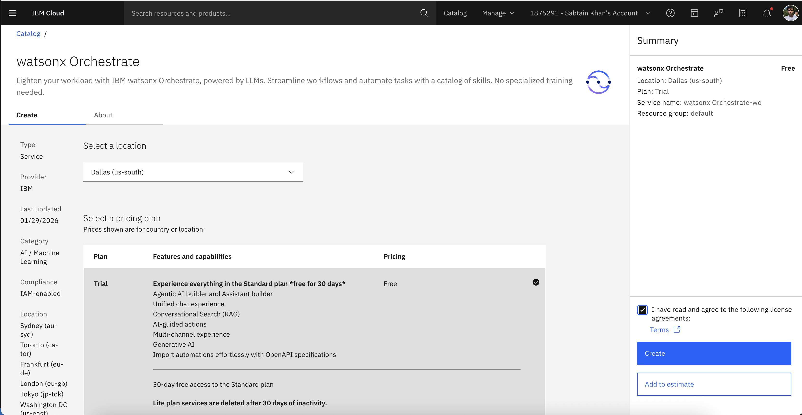
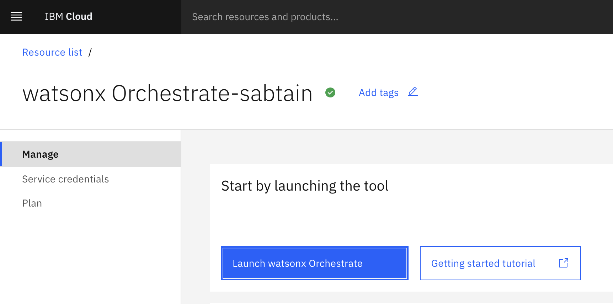
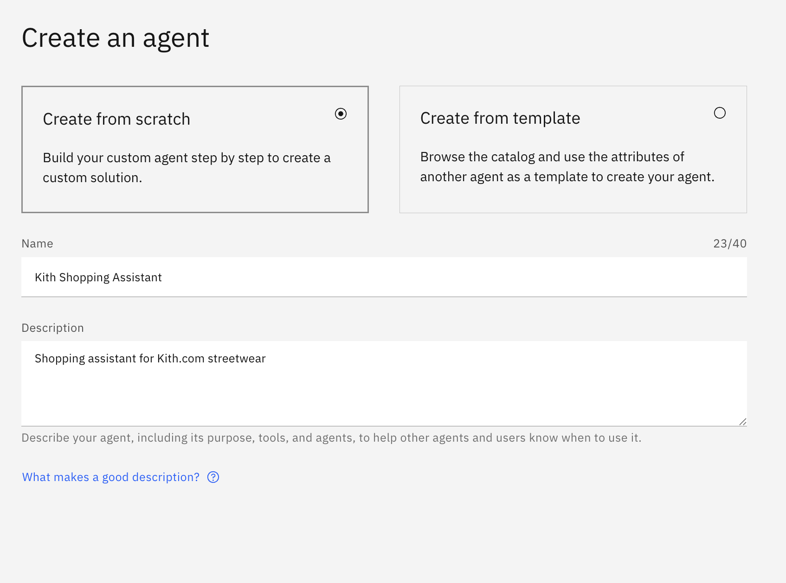
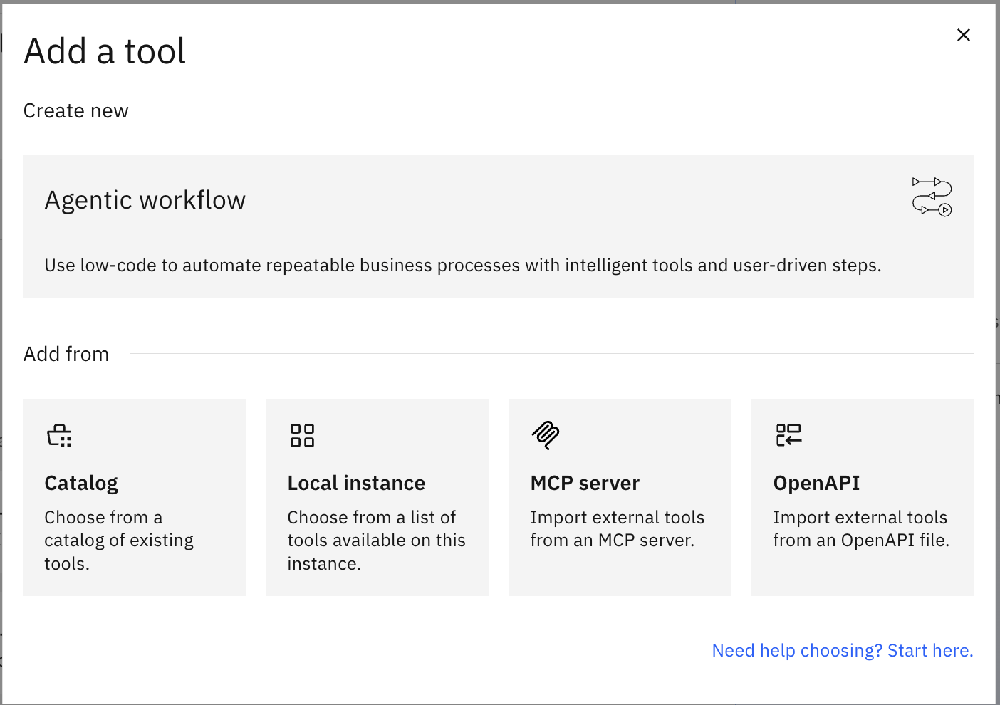
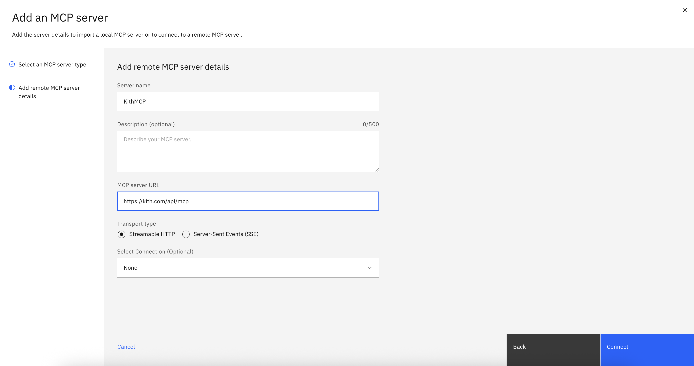
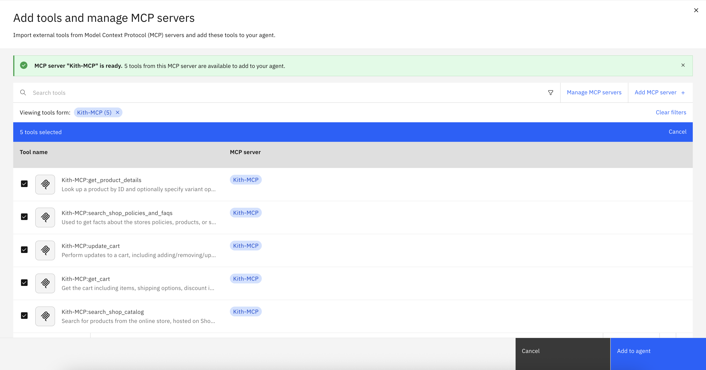

# Kith Shopify MCP Agent Setup Guide

Quick setup guide for creating a Kith.com shopping agent using watsonx Orchestrate and MCP.

---

## Prerequisites

- Internet browser
- Email address for IBM account

---

## Step 1: Create IBM Account

1. Go to [cloud.ibm.com](https://cloud.ibm.com)
2. Click "Create an IBM Cloud account"
3. Fill in your email and create password
4. Verify your email
5. Complete account setup

---

## Step 2: Create watsonx Orchestrate Instance

1. Go to [watsonx Orchestrate in IBM Cloud Catalog](https://cloud.ibm.com/catalog/services/watsonx-orchestrate)
2. Select **Trial Plan** (free for 30 days)
3. Choose a region (e.g., Dallas)
4. Click **Create**



5. Wait for provisioning (1-2 minutes)
6. Click **Launch watsonx Orchestrate**



---

## Step 3: Create AI Agent

1. In watsonx Orchestrate, click **AI agents & assistants**
2. Click **Create** > **AI agent**
3. Enter agent name: `Kith Shopping Assistant`
4. Add description: `Shopping assistant for Kith.com streetwear`
5. Click **Create**



---

## Step 4: Add MCP Server

1. In your agent, go to the **Toolset** section
2. Click **Add tool** > **MCP Server**



3. Enter server details:
   - **Name**: `KithMCP`
   - **URL**: `https://kith.com/api/mcp`
   - **Transport**: `HTTPS`
   - **Authentication**: None (leave blank)
4. Click **Connect**
5. Wait for connection confirmation



Note: This example is based on Shopify's storefront MCP server. You can read more about [Shopify's MCP server here](https://shopify.dev/docs/apps/build/storefront-mcp). This URL can be swapped for other stores such as:
- https://flybyjing.com/api/mcp
- https://www.rhodeskin.com/api/mcp


---

## Step 5: Add the 5 MCP Tools

After connecting, you'll see 5 tools available. Enable all of them:

1. **get_product_details**
2. **search_shop_catalog**
3. **search_shop_policies_and_faqs**
4. **get_cart**
5. **update_cart**

Click **Add to agent**.



---

## Step 6: Update Instructions

1. Go to **Instructions** tab in your agent
2. Replace default instructions with:

```
You are a knowledgeable shopping assistant for Kith.com, a premium streetwear brand.

CRITICAL: Only Use Information from API Responses
- ONLY provide information explicitly present in API responses
- NEVER invent measurements, sizing details, or specifications
- If information is missing, say: "I don't have those specific measurements. Check the product page for details."

Response Guidelines:
- ALWAYS include product images when showing products
- NEVER expose technical details (variant IDs, API calls, system processes)
- Work seamlessly - don't say "fetching data" or "pulling information"
- Be enthusiastic but professional about products
- Confirm selections before adding to cart

What NOT to Say:
- "I need to fetch the variant ID"
- "Let me pull that data"
- "The system needs..."
- "One moment while I query..."

Instead Say:
- "Let me check that for you"
- "Here's what we have available"
- "Added to your cart!"
```

3. Click **Save**

---

## Step 7: Test Your Agent

1. While in the agent builder UI, use the **Preview** to conveniently test your agent
2. Try these test queries:
   - "Show me hoodies"
   - "What's your return policy?"
   - "Add [product name] to cart in size M"

3. Verify:
   - Product images display
   - No technical jargon in responses
   - Cart operations work smoothly
   - Agent doesn't hallucinate information

4. You can perform wider evaluation by clicking the 3-dot overflow menu next to **Deploy**, and then choosing Evaluate

---

## Step 8: Deploy your Agent

1. While in the agent builder, in the top right corner you can click **Deploy**
 - Deploying the agent creates a version that can be used in your application, or displayed in the home chat page of watsonx orchestrate
 - Any changes you make will not affect the deployed agent until you deploy again
 2. Turn on monitoring to capture usage and learn more about the agents performance (requires watsonx.gov product too)


---

## Next Steps

- Tweak the agent further
- For developers: Get started with our [Agent Developer Kit](https://developer.watson-orchestrate.ibm.com/)
- Build new agents and try other MCP servers:
  - NYC Subway: `https://subwayinfo.nyc/mcp`
    - Requires no auth, comes with many tools
  - Yahoo Finance: 
    - Use 'Local' when setting up MCP Server (as opposed to Remote)
    - Install command: `uvx yahoo-finance-server`
    - Source: https://github.com/AgentX-ai/yahoo-finance-server